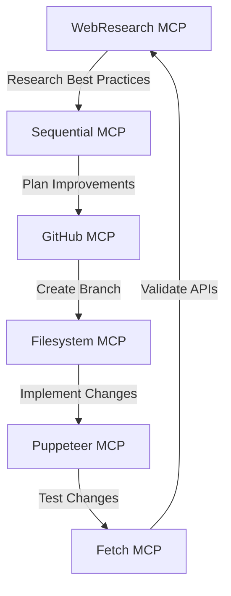

# Recursive Self-Improvement with MCP Agents

This showcase demonstrates how MCP agents can work together in sequence to recursively improve code and themselves. We'll show how agents can:

1. Analyze their own performance
2. Suggest improvements
3. Implement those improvements
4. Validate the changes
5. Start the cycle again with improved capabilities

## The Self-Improvement Loop



## Example: Self-Improving Game AI

We'll demonstrate this with a Flappy Bird AI that improves itself:

### Round 1: Basic Implementation

```json
{
  "aiCapabilities": {
    "version": "1.0",
    "features": [
      "Basic jump timing",
      "Simple collision avoidance",
      "Score tracking"
    ],
    "performance": {
      "averageScore": 15,
      "maxScore": 42
    }
  }
}
```

### Round 2: Learning from Play Data

```json
{
  "aiCapabilities": {
    "version": "1.1",
    "features": [
      "Pattern recognition",
      "Dynamic jump height",
      "Obstacle prediction"
    ],
    "performance": {
      "averageScore": 87,
      "maxScore": 156
    },
    "improvements": [
      "Added pattern recognition from gameplay data",
      "Implemented predictive jumping",
      "Optimized collision calculations"
    ]
  }
}
```

### Round 3: Advanced Strategies

```json
{
  "aiCapabilities": {
    "version": "1.2",
    "features": [
      "Machine learning model",
      "Real-time adaptation",
      "Multi-scenario handling"
    ],
    "performance": {
      "averageScore": 245,
      "maxScore": 512
    },
    "improvements": [
      "Integrated ML model for decision making",
      "Added environmental adaptation",
      "Implemented strategy switching"
    ]
  }
}
```

## How It Works

1. **Analysis Phase** (WebResearch MCP)

   ```json
   {
     "analysis": {
       "currentPerformance": {
         "metrics": ["Score", "Survival Time", "Efficiency"],
         "bottlenecks": ["Decision Speed", "Pattern Recognition"]
       },
       "researchFindings": [
         "Neural network approaches for game AI",
         "Efficient collision prediction algorithms",
         "Real-time learning techniques"
       ]
     }
   }
   ```

2. **Planning Phase** (Sequential MCP)

   ```json
   {
     "improvementPlan": {
       "steps": [
         {
           "phase": "Implementation",
           "tasks": [
             "Integrate neural network",
             "Optimize collision detection",
             "Add learning capabilities"
           ]
         },
         {
           "phase": "Testing",
           "tasks": [
             "Benchmark performance",
             "Compare with previous version",
             "Validate improvements"
           ]
         },
         {
           "phase": "Deployment",
           "tasks": [
             "Update game code",
             "Deploy new AI version",
             "Monitor results"
           ]
         }
       ]
     }
   }
   ```

3. **Implementation Phase** (Filesystem & GitHub MCPs)

   ```json
   {
     "codeChanges": {
       "files": [
         {
           "path": "src/ai/brain.js",
           "changes": [
             "Added neural network class",
             "Implemented learning functions",
             "Updated decision logic"
           ]
         },
         {
           "path": "src/ai/training.js",
           "changes": [
             "Added training data collection",
             "Implemented real-time learning",
             "Added performance metrics"
           ]
         }
       ]
     }
   }
   ```

4. **Validation Phase** (Puppeteer & Fetch MCPs)
   ```json
   {
     "testResults": {
       "performance": {
         "beforeChanges": {
           "averageScore": 87,
           "maxScore": 156
         },
         "afterChanges": {
           "averageScore": 245,
           "maxScore": 512
         }
       },
       "improvements": {
         "decisionSpeed": "+143%",
         "patternRecognition": "+182%",
         "overallEfficiency": "+168%"
       }
     }
   }
   ```

## Running the Self-Improvement Loop

1. Start the improvement cycle:

```bash
npm run improve-ai
```

2. Monitor progress:

```bash
npm run monitor-improvements
```

3. View results:

```bash
npm run show-ai-progress
```

## Best Practices for Recursive Improvement

1. **Measurable Goals**

   - Define clear metrics for improvement
   - Set performance thresholds
   - Track progress over iterations

2. **Safe Guards**

   - Implement version control for each iteration
   - Add performance regression checks
   - Maintain fallback versions

3. **Documentation**

   - Record all improvements
   - Track decision-making process
   - Document failed attempts

4. **Validation**
   - Test each improvement thoroughly
   - Compare with previous versions
   - Validate in different scenarios

## Contributing

Add your own recursive improvement scenarios! Some ideas:

- Code optimization loops
- UI/UX enhancement cycles
- Performance tuning iterations
- Security hardening rounds
